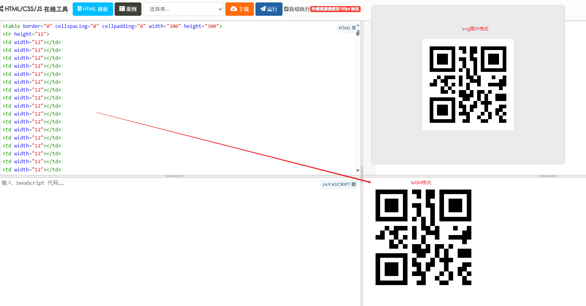

# QRcode_bypass_-phishing
钓鱼邮件二维码绕过

##### 转换二维码的svg图片格式为<table>表格后嵌入正文实现二维码效果

> 背景

希望发送携带二维码的钓鱼邮件，但是目标邮服务器不支持显示img以及canvas等图片

```html


<head>
<script src="https://cdn.jsdelivr.net/npm/qrcode"></script>
</head>
<body>
<canvas id="qrcode"></canvas>
    <script>
        // 要生成二维码的内容
        const text = "https://www.example.com";
        // 获取 canvas 元素
        const canvas = document.getElementById("qrcode");
        // 使用 QRCode.js 生成二维码
        QRCode.toCanvas(canvas, text, function (error) {
            if (error) console.error(error);
            console.log("二维码生成成功！");
        });
        //使用 QRCode.js 库生成二维码。 二维码会被绘制到 <canvas> 元素中，而不是通过  标签显示
    </script>
</body>
```

上述三种方法都无法在邮件的正文中使用

> 思路  最原始的方法直接显示黑白方块

获取二维码的svg元素的html代码 

 

```c
<?xml version="1.0" encoding="utf-8"?>
<svg width="300" height="300" viewBox="0 0 300 300" xmlns="http://www.w3.org/2000/svg" xmlns:xlink="http://www.w3.org/1999/xlink">
<rect width="300" height="300" fill="#ffffff"/>
<defs>
<rect id="p" width="12" height="12" />
</defs>
<g>
<use x="24" y="24" xlink:href="#p" fill="#000000" />
<use x="36" y="24" xlink:href="#p" fill="#000000" />
<use x="48" y="24" xlink:href="#p" fill="#000000" />
<use x="60" y="24" xlink:href="#p" fill="#000000" />
<use x="72" y="24" xlink:href="#p" fill="#000000" />
<use x="84" y="24" xlink:href="#p" fill="#000000" />
<use x="96" y="24" xlink:href="#p" fill="#000000" />
<use x="120" y="24" xlink:href="#p" fill="#000000" />
<use x="132" y="24" xlink:href="#p" fill="#000000" />
<use x="156" y="24" xlink:href="#p" fill="#000000" />
<use x="168" y="24" xlink:href="#p" fill="#000000" />
<use x="192" y="24" xlink:href="#p" fill="#000000" />
<use x="204" y="24" xlink:href="#p" fill="#000000" />
<use x="216" y="24" xlink:href="#p" fill="#000000" />
<use x="228" y="24" xlink:href="#p" fill="#000000" />
<use x="240" y="24" xlink:href="#p" fill="#000000" />
<use x="252" y="24" xlink:href="#p" fill="#000000" />
<use x="264" y="24" xlink:href="#p" fill="#000000" />
<use x="24" y="36" xlink:href="#p" fill="#000000" />
<use x="96" y="36" xlink:href="#p" fill="#000000" />
<use x="132" y="36" xlink:href="#p" fill="#000000" />
<use x="156" y="36" xlink:href="#p" fill="#000000" />
<use x="168" y="36" xlink:href="#p" fill="#000000" />
<use x="192" y="36" xlink:href="#p" fill="#000000" />
<use x="264" y="36" xlink:href="#p" fill="#000000" />
<use x="24" y="48" xlink:href="#p" fill="#000000" />
<use x="48" y="48" xlink:href="#p" fill="#000000" />
<use x="60" y="48" xlink:href="#p" fill="#000000" />
<use x="72" y="48" xlink:href="#p" fill="#000000" />
<use x="96" y="48" xlink:href="#p" fill="#000000" />
<use x="156" y="48" xlink:href="#p" fill="#000000" />
<use x="192" y="48" xlink:href="#p" fill="#000000" />
<use x="216" y="48" xlink:href="#p" fill="#000000" />
<use x="228" y="48" xlink:href="#p" fill="#000000" />
<use x="240" y="48" xlink:href="#p" fill="#000000" />
<use x="264" y="48" xlink:href="#p" fill="#000000" />
<use x="24" y="60" xlink:href="#p" fill="#000000" />
<use x="48" y="60" xlink:href="#p" fill="#000000" />
<use x="60" y="60" xlink:href="#p" fill="#000000" />
<use x="72" y="60" xlink:href="#p" fill="#000000" />
<use x="96" y="60" xlink:href="#p" fill="#000000" />
<use x="120" y="60" xlink:href="#p" fill="#000000" />
<use x="132" y="60" xlink:href="#p" fill="#000000" />
<use x="156" y="60" xlink:href="#p" fill="#000000" />
<use x="168" y="60" xlink:href="#p" fill="#000000" />
<use x="192" y="60" xlink:href="#p" fill="#000000" />
<use x="216" y="60" xlink:href="#p" fill="#000000" />
<use x="228" y="60" xlink:href="#p" fill="#000000" />
<use x="240" y="60" xlink:href="#p" fill="#000000" />
<use x="264" y="60" xlink:href="#p" fill="#000000" />
<use x="24" y="72" xlink:href="#p" fill="#000000" />
<use x="48" y="72" xlink:href="#p" fill="#000000" />
<use x="60" y="72" xlink:href="#p" fill="#000000" />
<use x="72" y="72" xlink:href="#p" fill="#000000" />
<use x="96" y="72" xlink:href="#p" fill="#000000" />
<use x="132" y="72" xlink:href="#p" fill="#000000" />
<use x="168" y="72" xlink:href="#p" fill="#000000" />
<use x="192" y="72" xlink:href="#p" fill="#000000" />
<use x="216" y="72" xlink:href="#p" fill="#000000" />
<use x="228" y="72" xlink:href="#p" fill="#000000" />
<use x="240" y="72" xlink:href="#p" fill="#000000" />
<use x="264" y="72" xlink:href="#p" fill="#000000" />
<use x="24" y="84" xlink:href="#p" fill="#000000" />
<use x="96" y="84" xlink:href="#p" fill="#000000" />
<use x="132" y="84" xlink:href="#p" fill="#000000" />
<use x="168" y="84" xlink:href="#p" fill="#000000" />
<use x="192" y="84" xlink:href="#p" fill="#000000" />
<use x="264" y="84" xlink:href="#p" fill="#000000" />
<use x="24" y="96" xlink:href="#p" fill="#000000" />
<use x="36" y="96" xlink:href="#p" fill="#000000" />
<use x="48" y="96" xlink:href="#p" fill="#000000" />
<use x="60" y="96" xlink:href="#p" fill="#000000" />
<use x="72" y="96" xlink:href="#p" fill="#000000" />
<use x="84" y="96" xlink:href="#p" fill="#000000" />
<use x="96" y="96" xlink:href="#p" fill="#000000" />
<use x="120" y="96" xlink:href="#p" fill="#000000" />
<use x="144" y="96" xlink:href="#p" fill="#000000" />
<use x="168" y="96" xlink:href="#p" fill="#000000" />
<use x="192" y="96" xlink:href="#p" fill="#000000" />
<use x="204" y="96" xlink:href="#p" fill="#000000" />
<use x="216" y="96" xlink:href="#p" fill="#000000" />
<use x="228" y="96" xlink:href="#p" fill="#000000" />
<use x="240" y="96" xlink:href="#p" fill="#000000" />
<use x="252" y="96" xlink:href="#p" fill="#000000" />
<use x="264" y="96" xlink:href="#p" fill="#000000" />
<use x="144" y="108" xlink:href="#p" fill="#000000" />
<use x="168" y="108" xlink:href="#p" fill="#000000" />
<use x="48" y="120" xlink:href="#p" fill="#000000" />
<use x="72" y="120" xlink:href="#p" fill="#000000" />
<use x="84" y="120" xlink:href="#p" fill="#000000" />
<use x="96" y="120" xlink:href="#p" fill="#000000" />
<use x="120" y="120" xlink:href="#p" fill="#000000" />
<use x="144" y="120" xlink:href="#p" fill="#000000" />
<use x="156" y="120" xlink:href="#p" fill="#000000" />
<use x="180" y="120" xlink:href="#p" fill="#000000" />
<use x="228" y="120" xlink:href="#p" fill="#000000" />
<use x="264" y="120" xlink:href="#p" fill="#000000" />
<use x="36" y="132" xlink:href="#p" fill="#000000" />
<use x="60" y="132" xlink:href="#p" fill="#000000" />
<use x="72" y="132" xlink:href="#p" fill="#000000" />
<use x="120" y="132" xlink:href="#p" fill="#000000" />
<use x="156" y="132" xlink:href="#p" fill="#000000" />
<use x="168" y="132" xlink:href="#p" fill="#000000" />
<use x="180" y="132" xlink:href="#p" fill="#000000" />
<use x="252" y="132" xlink:href="#p" fill="#000000" />
<use x="264" y="132" xlink:href="#p" fill="#000000" />
<use x="24" y="144" xlink:href="#p" fill="#000000" />
<use x="36" y="144" xlink:href="#p" fill="#000000" />
<use x="72" y="144" xlink:href="#p" fill="#000000" />
<use x="96" y="144" xlink:href="#p" fill="#000000" />
<use x="120" y="144" xlink:href="#p" fill="#000000" />
<use x="144" y="144" xlink:href="#p" fill="#000000" />
<use x="180" y="144" xlink:href="#p" fill="#000000" />
<use x="216" y="144" xlink:href="#p" fill="#000000" />
<use x="228" y="144" xlink:href="#p" fill="#000000" />
<use x="240" y="144" xlink:href="#p" fill="#000000" />
<use x="252" y="144" xlink:href="#p" fill="#000000" />
<use x="264" y="144" xlink:href="#p" fill="#000000" />
<use x="60" y="156" xlink:href="#p" fill="#000000" />
<use x="84" y="156" xlink:href="#p" fill="#000000" />
<use x="144" y="156" xlink:href="#p" fill="#000000" />
<use x="252" y="156" xlink:href="#p" fill="#000000" />
<use x="60" y="168" xlink:href="#p" fill="#000000" />
<use x="72" y="168" xlink:href="#p" fill="#000000" />
<use x="96" y="168" xlink:href="#p" fill="#000000" />
<use x="120" y="168" xlink:href="#p" fill="#000000" />
<use x="132" y="168" xlink:href="#p" fill="#000000" />
<use x="156" y="168" xlink:href="#p" fill="#000000" />
<use x="180" y="168" xlink:href="#p" fill="#000000" />
<use x="192" y="168" xlink:href="#p" fill="#000000" />
<use x="216" y="168" xlink:href="#p" fill="#000000" />
<use x="120" y="180" xlink:href="#p" fill="#000000" />
<use x="132" y="180" xlink:href="#p" fill="#000000" />
<use x="144" y="180" xlink:href="#p" fill="#000000" />
<use x="156" y="180" xlink:href="#p" fill="#000000" />
<use x="180" y="180" xlink:href="#p" fill="#000000" />
<use x="204" y="180" xlink:href="#p" fill="#000000" />
<use x="240" y="180" xlink:href="#p" fill="#000000" />
<use x="252" y="180" xlink:href="#p" fill="#000000" />
<use x="264" y="180" xlink:href="#p" fill="#000000" />
<use x="24" y="192" xlink:href="#p" fill="#000000" />
<use x="36" y="192" xlink:href="#p" fill="#000000" />
<use x="48" y="192" xlink:href="#p" fill="#000000" />
<use x="60" y="192" xlink:href="#p" fill="#000000" />
<use x="72" y="192" xlink:href="#p" fill="#000000" />
<use x="84" y="192" xlink:href="#p" fill="#000000" />
<use x="96" y="192" xlink:href="#p" fill="#000000" />
<use x="132" y="192" xlink:href="#p" fill="#000000" />
<use x="144" y="192" xlink:href="#p" fill="#000000" />
<use x="180" y="192" xlink:href="#p" fill="#000000" />
<use x="204" y="192" xlink:href="#p" fill="#000000" />
<use x="240" y="192" xlink:href="#p" fill="#000000" />
<use x="252" y="192" xlink:href="#p" fill="#000000" />
<use x="264" y="192" xlink:href="#p" fill="#000000" />
<use x="24" y="204" xlink:href="#p" fill="#000000" />
<use x="96" y="204" xlink:href="#p" fill="#000000" />
<use x="120" y="204" xlink:href="#p" fill="#000000" />
<use x="168" y="204" xlink:href="#p" fill="#000000" />
<use x="192" y="204" xlink:href="#p" fill="#000000" />
<use x="204" y="204" xlink:href="#p" fill="#000000" />
<use x="216" y="204" xlink:href="#p" fill="#000000" />
<use x="24" y="216" xlink:href="#p" fill="#000000" />
<use x="48" y="216" xlink:href="#p" fill="#000000" />
<use x="60" y="216" xlink:href="#p" fill="#000000" />
<use x="72" y="216" xlink:href="#p" fill="#000000" />
<use x="96" y="216" xlink:href="#p" fill="#000000" />
<use x="120" y="216" xlink:href="#p" fill="#000000" />
<use x="132" y="216" xlink:href="#p" fill="#000000" />
<use x="156" y="216" xlink:href="#p" fill="#000000" />
<use x="168" y="216" xlink:href="#p" fill="#000000" />
<use x="204" y="216" xlink:href="#p" fill="#000000" />
<use x="252" y="216" xlink:href="#p" fill="#000000" />
<use x="264" y="216" xlink:href="#p" fill="#000000" />
<use x="24" y="228" xlink:href="#p" fill="#000000" />
<use x="48" y="228" xlink:href="#p" fill="#000000" />
<use x="60" y="228" xlink:href="#p" fill="#000000" />
<use x="72" y="228" xlink:href="#p" fill="#000000" />
<use x="96" y="228" xlink:href="#p" fill="#000000" />
<use x="132" y="228" xlink:href="#p" fill="#000000" />
<use x="156" y="228" xlink:href="#p" fill="#000000" />
<use x="204" y="228" xlink:href="#p" fill="#000000" />
<use x="240" y="228" xlink:href="#p" fill="#000000" />
<use x="252" y="228" xlink:href="#p" fill="#000000" />
<use x="24" y="240" xlink:href="#p" fill="#000000" />
<use x="48" y="240" xlink:href="#p" fill="#000000" />
<use x="60" y="240" xlink:href="#p" fill="#000000" />
<use x="72" y="240" xlink:href="#p" fill="#000000" />
<use x="96" y="240" xlink:href="#p" fill="#000000" />
<use x="120" y="240" xlink:href="#p" fill="#000000" />
<use x="132" y="240" xlink:href="#p" fill="#000000" />
<use x="144" y="240" xlink:href="#p" fill="#000000" />
<use x="192" y="240" xlink:href="#p" fill="#000000" />
<use x="216" y="240" xlink:href="#p" fill="#000000" />
<use x="240" y="240" xlink:href="#p" fill="#000000" />
<use x="264" y="240" xlink:href="#p" fill="#000000" />
<use x="24" y="252" xlink:href="#p" fill="#000000" />
<use x="96" y="252" xlink:href="#p" fill="#000000" />
<use x="144" y="252" xlink:href="#p" fill="#000000" />
<use x="180" y="252" xlink:href="#p" fill="#000000" />
<use x="216" y="252" xlink:href="#p" fill="#000000" />
<use x="252" y="252" xlink:href="#p" fill="#000000" />
<use x="24" y="264" xlink:href="#p" fill="#000000" />
<use x="36" y="264" xlink:href="#p" fill="#000000" />
<use x="48" y="264" xlink:href="#p" fill="#000000" />
<use x="60" y="264" xlink:href="#p" fill="#000000" />
<use x="72" y="264" xlink:href="#p" fill="#000000" />
<use x="84" y="264" xlink:href="#p" fill="#000000" />
<use x="96" y="264" xlink:href="#p" fill="#000000" />
<use x="132" y="264" xlink:href="#p" fill="#000000" />
<use x="144" y="264" xlink:href="#p" fill="#000000" />
<use x="192" y="264" xlink:href="#p" fill="#000000" />
<use x="204" y="264" xlink:href="#p" fill="#000000" />
<use x="252" y="264" xlink:href="#p" fill="#000000" />
<use x="264" y="264" xlink:href="#p" fill="#000000" />
</g>
</svg>
```

1. **创建一个 `<table>` 元素**：

   - 表格的行数和列数根据 SVG 的大小和方块的大小计算得出。

   - SVG 的大小是 300x300，每个方块的大小是 12x12，因此表格的行数和列数为 `300 / 12 = 25`。

     还可以尝试用<div>元素试试（不过邮件中无法使用<style>需要额外把属性配置到每个div里）

     ```c
         <style>
             /* 容器样式 */
             .container {
                 display: grid;
                 grid-template-columns: repeat(25, 12px); /* 25 列，每列 12px */
                 grid-template-rows: repeat(25, 12px); /* 25 行，每行 12px */
                 width: 300px;
                 height: 300px;
                 background-color: #ffffff; /* 白色背景 */
             }
     
             /* 方块样式 */
             .block {
                 width: 12px;
                 height: 12px;
                 background-color: #000000; /* 黑色方块 */
             }
         </style>
     </head>
     <body>
         <h1>CSS Grid 方块模拟</h1>
         <div class="container">
             <!-- 根据 SVG 中的 <use> 元素位置填充方块 -->
             <div class="block" style="grid-column: 3; grid-row: 3;"></div>
             <div class="block" style="grid-column: 4; grid-row: 3;"></div>
             <div class="block" style="grid-column: 5; grid-row: 3;"></div>
             <div class="block" style="grid-column: 6; grid-row: 3;"></div>
             <div class="block" style="grid-column: 7; grid-row: 3;"></div>
             <div class="block" style="grid-column: 8; grid-row: 3;"></div>
             <div class="block" style="grid-column: 9; grid-row: 3;"></div>
             <div class="block" style="grid-column: 11; grid-row: 3;"></div>
             <div class="block" style="grid-column: 12; grid-row: 3;"></div>
             <div class="block" style="grid-column: 14; grid-row: 3;"></div>
             <div class="block" style="grid-column: 15; grid-row: 3;"></div>
             <div class="block" style="grid-column: 17; grid-row: 3;"></div>
             <div class="block" style="grid-column: 18; grid-row: 3;"></div>
             <div class="block" style="grid-column: 19; grid-row: 3;"></div>
             <div class="block" style="grid-column: 20; grid-row: 3;"></div>
             <div class="block" style="grid-column: 21; grid-row: 3;"></div>
             <div class="block" style="grid-column: 22; grid-row: 3;"></div>
             <div class="block" style="grid-column: 23; grid-row: 3;"></div>
             <!-- 继续添加其他方块 -->
         </div>
     </body>
     ```

2. **填充黑色方块**：

   - 根据 SVG 中 `<use>` 元素的 `x` 和 `y` 属性，计算对应的表格行和列。
   - 在对应的 `<td>` 单元格中设置背景颜色为黑色。

3. **表格结构**：
   - 每个 `<tr>` 代表一行，每个 `<td>` 代表一个单元格。
   - 通过设置 `<td>` 的 `bgcolor` 属性为 `#000000` 来模拟黑色方块。

4. **位置计算**：

   - 根据 SVG 中 `<use>` 元素的 `x` 和 `y` 属性，计算对应的表格行和列。

     例如，`<use x="24" y="24">` 对应的表格位置为第 3 行第 3 列（因为 `24 / 12 = 2`，索引从 0 开始）。

> 脚本 将二维码的 SVG 图片转换为 HTML 的 `<table>` 元素。该脚本会解析 SVG 文件中的 `<use>` 元素，提取方块的位置信息，并生成对应的 HTML 表格。

```python
'''
Author: your name
Date: 2025-03-17 17:41:49
LastEditTime: 2025-03-17 17:42:01
LastEditors: StickWK
Description: In User Settings Edit
FilePath: \邮件钓鱼\qrcode_table.py
'''
from xml.etree import ElementTree as ET
#使用 Python 标准库 xml.etree.ElementTree 解析 SVG 文件，无需额外安装依赖
#假设 SVG 文件中的方块是通过 <use> 元素引用的 <rect> 元素
def svg_to_table(svg_file, output_file):
    # 解析 SVG 文件
    tree = ET.parse(svg_file)
    root = tree.getroot()

    # 获取 SVG 的宽度和高度
    #width = int(root.attrib['width'])
    #height = int(root.attrib['height'])
    width = 300
    height = 300

    # 获取方块的大小（假设所有方块大小相同）
    #block_size = int(root.find('rect').attrib['width'])
    block_size = 12
    # 计算表格的行数和列数
    rows = height // block_size
    cols = width // block_size

    # 初始化表格数据
    table = [[0 for _ in range(cols)] for _ in range(rows)]

    # 提取所有 <use> 元素的位置信息
    for use in root.findall('.//{http://www.w3.org/2000/svg}use'):
        x = int(float(use.attrib['x']))
        y = int(float(use.attrib['y']))
        # 计算表格中的行和列
        row = y // block_size
        col = x // block_size
        # 标记该位置为黑色方块
        table[row][col] = 1

    # 生成 HTML 表格
    html = ['<table border="0" cellspacing="0" cellpadding="0" width="{}" height="{}">'.format(width, height)]
    for row in table:
        html.append('<tr height="{}">'.format(block_size))
        for cell in row:
            if cell == 1:
                html.append('<td width="{}" bgcolor="#000000"></td>'.format(block_size))
            else:
                html.append('<td width="{}"></td>'.format(block_size))
        html.append('</tr>')
    html.append('</table>')

    # 将 HTML 写入文件
    with open(output_file, 'w', encoding='utf-8') as f:
        f.write('\n'.join(html))

    print(f"HTML 表格已生成并保存到 {output_file}")

# 示例用法
svg_file = 'qrcode.svg'  # 输入的 SVG 文件路径
output_file = 'qrcode_table.html'  # 输出的 HTML 文件路径
svg_to_table(svg_file, output_file)
```

 

将生成的table元素嵌入到配置正文的txt文件中，随后发送即可

```c
swaks --to haihang.yu@amh-group.com --from 19825067300@163.com --h-From: '黄强<huangqinag@douwudao.com>'  --ehlo shanxi.gov.cn --server smtp.163.com -p 25 -au 19825067300@163.com  -ap WXWDSQRDVXVNVAIF -data @test_qrcode.txt
```

test_qrcode.txt

```c
From: 19825067300@163.com
To: yang.deng@amh-group.com
Subject: Test Email
MIME-Version: 1.0
Content-Type: multipart/mixed; boundary="boundary123"

--boundary123
Content-Type: text/html; charset="utf-8"
Content-Transfer-Encoding: 7bit

<!DOCTYPE html>
<html lang="zh-CN">
<head>
    <meta charset="UTF-8">
    <meta name="viewport" content="width=device-width, initial-scale=1.0">
</head>
<body>
<table border="0" cellspacing="0" cellpadding="0" width="300" height="300">
<tr height="12">
<td width="12"></td>
<td width="12"></td>
<td width="12"></td>
<td width="12"></td>
<td width="12"></td>
<td width="12"></td>
<td width="12"></td>
<td width="12"></td>
<td width="12"></td>
<td width="12"></td>
<td width="12"></td>
<td width="12"></td>
<td width="12"></td>
<td width="12"></td>
<td width="12"></td>
<td width="12"></td>
<td width="12"></td>
<td width="12"></td>
<td width="12"></td>
<td width="12"></td>
<td width="12"></td>
<td width="12"></td>
<td width="12"></td>
<td width="12"></td>
<td width="12"></td>
</tr>
<tr height="12">
<td width="12"></td>
<td width="12"></td>
<td width="12"></td>
<td width="12"></td>
<td width="12"></td>
<td width="12"></td>
<td width="12"></td>
<td width="12"></td>
<td width="12"></td>
<td width="12"></td>
<td width="12"></td>
<td width="12"></td>
<td width="12"></td>
<td width="12"></td>
<td width="12"></td>
<td width="12"></td>
<td width="12"></td>
<td width="12"></td>
<td width="12"></td>
<td width="12"></td>
<td width="12"></td>
<td width="12"></td>
<td width="12"></td>
<td width="12"></td>
<td width="12"></td>
</tr>
<tr height="12">
<td width="12"></td>
<td width="12"></td>
<td width="12" bgcolor="#000000"></td>
<td width="12" bgcolor="#000000"></td>
<td width="12" bgcolor="#000000"></td>
<td width="12" bgcolor="#000000"></td>
<td width="12" bgcolor="#000000"></td>
<td width="12" bgcolor="#000000"></td>
<td width="12" bgcolor="#000000"></td>
<td width="12"></td>
<td width="12" bgcolor="#000000"></td>
<td width="12" bgcolor="#000000"></td>
<td width="12"></td>
<td width="12" bgcolor="#000000"></td>
<td width="12" bgcolor="#000000"></td>
<td width="12"></td>
<td width="12" bgcolor="#000000"></td>
<td width="12" bgcolor="#000000"></td>
<td width="12" bgcolor="#000000"></td>
<td width="12" bgcolor="#000000"></td>
<td width="12" bgcolor="#000000"></td>
<td width="12" bgcolor="#000000"></td>
<td width="12" bgcolor="#000000"></td>
<td width="12"></td>
<td width="12"></td>
</tr>
<tr height="12">
<td width="12"></td>
<td width="12"></td>
<td width="12" bgcolor="#000000"></td>
<td width="12"></td>
<td width="12"></td>
<td width="12"></td>
<td width="12"></td>
<td width="12"></td>
<td width="12" bgcolor="#000000"></td>
<td width="12"></td>
<td width="12"></td>
<td width="12" bgcolor="#000000"></td>
<td width="12"></td>
<td width="12" bgcolor="#000000"></td>
<td width="12" bgcolor="#000000"></td>
<td width="12"></td>
<td width="12" bgcolor="#000000"></td>
<td width="12"></td>
<td width="12"></td>
<td width="12"></td>
<td width="12"></td>
<td width="12"></td>
<td width="12" bgcolor="#000000"></td>
<td width="12"></td>
<td width="12"></td>
</tr>
<tr height="12">
<td width="12"></td>
<td width="12"></td>
<td width="12" bgcolor="#000000"></td>
<td width="12"></td>
<td width="12" bgcolor="#000000"></td>
<td width="12" bgcolor="#000000"></td>
<td width="12" bgcolor="#000000"></td>
<td width="12"></td>
<td width="12" bgcolor="#000000"></td>
<td width="12"></td>
<td width="12"></td>
<td width="12"></td>
<td width="12"></td>
<td width="12" bgcolor="#000000"></td>
<td width="12"></td>
<td width="12"></td>
<td width="12" bgcolor="#000000"></td>
<td width="12"></td>
<td width="12" bgcolor="#000000"></td>
<td width="12" bgcolor="#000000"></td>
<td width="12" bgcolor="#000000"></td>
<td width="12"></td>
<td width="12" bgcolor="#000000"></td>
<td width="12"></td>
<td width="12"></td>
</tr>
<tr height="12">
<td width="12"></td>
<td width="12"></td>
<td width="12" bgcolor="#000000"></td>
<td width="12"></td>
<td width="12" bgcolor="#000000"></td>
<td width="12" bgcolor="#000000"></td>
<td width="12" bgcolor="#000000"></td>
<td width="12"></td>
<td width="12" bgcolor="#000000"></td>
<td width="12"></td>
<td width="12" bgcolor="#000000"></td>
<td width="12" bgcolor="#000000"></td>
<td width="12"></td>
<td width="12" bgcolor="#000000"></td>
<td width="12" bgcolor="#000000"></td>
<td width="12"></td>
<td width="12" bgcolor="#000000"></td>
<td width="12"></td>
<td width="12" bgcolor="#000000"></td>
<td width="12" bgcolor="#000000"></td>
<td width="12" bgcolor="#000000"></td>
<td width="12"></td>
<td width="12" bgcolor="#000000"></td>
<td width="12"></td>
<td width="12"></td>
</tr>
<tr height="12">
<td width="12"></td>
<td width="12"></td>
<td width="12" bgcolor="#000000"></td>
<td width="12"></td>
<td width="12" bgcolor="#000000"></td>
<td width="12" bgcolor="#000000"></td>
<td width="12" bgcolor="#000000"></td>
<td width="12"></td>
<td width="12" bgcolor="#000000"></td>
<td width="12"></td>
<td width="12"></td>
<td width="12" bgcolor="#000000"></td>
<td width="12"></td>
<td width="12"></td>
<td width="12" bgcolor="#000000"></td>
<td width="12"></td>
<td width="12" bgcolor="#000000"></td>
<td width="12"></td>
<td width="12" bgcolor="#000000"></td>
<td width="12" bgcolor="#000000"></td>
<td width="12" bgcolor="#000000"></td>
<td width="12"></td>
<td width="12" bgcolor="#000000"></td>
<td width="12"></td>
<td width="12"></td>
</tr>
<tr height="12">
<td width="12"></td>
<td width="12"></td>
<td width="12" bgcolor="#000000"></td>
<td width="12"></td>
<td width="12"></td>
<td width="12"></td>
<td width="12"></td>
<td width="12"></td>
<td width="12" bgcolor="#000000"></td>
<td width="12"></td>
<td width="12"></td>
<td width="12" bgcolor="#000000"></td>
<td width="12"></td>
<td width="12"></td>
<td width="12" bgcolor="#000000"></td>
<td width="12"></td>
<td width="12" bgcolor="#000000"></td>
<td width="12"></td>
<td width="12"></td>
<td width="12"></td>
<td width="12"></td>
<td width="12"></td>
<td width="12" bgcolor="#000000"></td>
<td width="12"></td>
<td width="12"></td>
</tr>
<tr height="12">
<td width="12"></td>
<td width="12"></td>
<td width="12" bgcolor="#000000"></td>
<td width="12" bgcolor="#000000"></td>
<td width="12" bgcolor="#000000"></td>
<td width="12" bgcolor="#000000"></td>
<td width="12" bgcolor="#000000"></td>
<td width="12" bgcolor="#000000"></td>
<td width="12" bgcolor="#000000"></td>
<td width="12"></td>
<td width="12" bgcolor="#000000"></td>
<td width="12"></td>
<td width="12" bgcolor="#000000"></td>
<td width="12"></td>
<td width="12" bgcolor="#000000"></td>
<td width="12"></td>
<td width="12" bgcolor="#000000"></td>
<td width="12" bgcolor="#000000"></td>
<td width="12" bgcolor="#000000"></td>
<td width="12" bgcolor="#000000"></td>
<td width="12" bgcolor="#000000"></td>
<td width="12" bgcolor="#000000"></td>
<td width="12" bgcolor="#000000"></td>
<td width="12"></td>
<td width="12"></td>
</tr>
<tr height="12">
<td width="12"></td>
<td width="12"></td>
<td width="12"></td>
<td width="12"></td>
<td width="12"></td>
<td width="12"></td>
<td width="12"></td>
<td width="12"></td>
<td width="12"></td>
<td width="12"></td>
<td width="12"></td>
<td width="12"></td>
<td width="12" bgcolor="#000000"></td>
<td width="12"></td>
<td width="12" bgcolor="#000000"></td>
<td width="12"></td>
<td width="12"></td>
<td width="12"></td>
<td width="12"></td>
<td width="12"></td>
<td width="12"></td>
<td width="12"></td>
<td width="12"></td>
<td width="12"></td>
<td width="12"></td>
</tr>
<tr height="12">
<td width="12"></td>
<td width="12"></td>
<td width="12"></td>
<td width="12"></td>
<td width="12" bgcolor="#000000"></td>
<td width="12"></td>
<td width="12" bgcolor="#000000"></td>
<td width="12" bgcolor="#000000"></td>
<td width="12" bgcolor="#000000"></td>
<td width="12"></td>
<td width="12" bgcolor="#000000"></td>
<td width="12"></td>
<td width="12" bgcolor="#000000"></td>
<td width="12" bgcolor="#000000"></td>
<td width="12"></td>
<td width="12" bgcolor="#000000"></td>
<td width="12"></td>
<td width="12"></td>
<td width="12"></td>
<td width="12" bgcolor="#000000"></td>
<td width="12"></td>
<td width="12"></td>
<td width="12" bgcolor="#000000"></td>
<td width="12"></td>
<td width="12"></td>
</tr>
<tr height="12">
<td width="12"></td>
<td width="12"></td>
<td width="12"></td>
<td width="12" bgcolor="#000000"></td>
<td width="12"></td>
<td width="12" bgcolor="#000000"></td>
<td width="12" bgcolor="#000000"></td>
<td width="12"></td>
<td width="12"></td>
<td width="12"></td>
<td width="12" bgcolor="#000000"></td>
<td width="12"></td>
<td width="12"></td>
<td width="12" bgcolor="#000000"></td>
<td width="12" bgcolor="#000000"></td>
<td width="12" bgcolor="#000000"></td>
<td width="12"></td>
<td width="12"></td>
<td width="12"></td>
<td width="12"></td>
<td width="12"></td>
<td width="12" bgcolor="#000000"></td>
<td width="12" bgcolor="#000000"></td>
<td width="12"></td>
<td width="12"></td>
</tr>
<tr height="12">
<td width="12"></td>
<td width="12"></td>
<td width="12" bgcolor="#000000"></td>
<td width="12" bgcolor="#000000"></td>
<td width="12"></td>
<td width="12"></td>
<td width="12" bgcolor="#000000"></td>
<td width="12"></td>
<td width="12" bgcolor="#000000"></td>
<td width="12"></td>
<td width="12" bgcolor="#000000"></td>
<td width="12"></td>
<td width="12" bgcolor="#000000"></td>
<td width="12"></td>
<td width="12"></td>
<td width="12" bgcolor="#000000"></td>
<td width="12"></td>
<td width="12"></td>
<td width="12" bgcolor="#000000"></td>
<td width="12" bgcolor="#000000"></td>
<td width="12" bgcolor="#000000"></td>
<td width="12" bgcolor="#000000"></td>
<td width="12" bgcolor="#000000"></td>
<td width="12"></td>
<td width="12"></td>
</tr>
<tr height="12">
<td width="12"></td>
<td width="12"></td>
<td width="12"></td>
<td width="12"></td>
<td width="12"></td>
<td width="12" bgcolor="#000000"></td>
<td width="12"></td>
<td width="12" bgcolor="#000000"></td>
<td width="12"></td>
<td width="12"></td>
<td width="12"></td>
<td width="12"></td>
<td width="12" bgcolor="#000000"></td>
<td width="12"></td>
<td width="12"></td>
<td width="12"></td>
<td width="12"></td>
<td width="12"></td>
<td width="12"></td>
<td width="12"></td>
<td width="12"></td>
<td width="12" bgcolor="#000000"></td>
<td width="12"></td>
<td width="12"></td>
<td width="12"></td>
</tr>
<tr height="12">
<td width="12"></td>
<td width="12"></td>
<td width="12"></td>
<td width="12"></td>
<td width="12"></td>
<td width="12" bgcolor="#000000"></td>
<td width="12" bgcolor="#000000"></td>
<td width="12"></td>
<td width="12" bgcolor="#000000"></td>
<td width="12"></td>
<td width="12" bgcolor="#000000"></td>
<td width="12" bgcolor="#000000"></td>
<td width="12"></td>
<td width="12" bgcolor="#000000"></td>
<td width="12"></td>
<td width="12" bgcolor="#000000"></td>
<td width="12" bgcolor="#000000"></td>
<td width="12"></td>
<td width="12" bgcolor="#000000"></td>
<td width="12"></td>
<td width="12"></td>
<td width="12"></td>
<td width="12"></td>
<td width="12"></td>
<td width="12"></td>
</tr>
<tr height="12">
<td width="12"></td>
<td width="12"></td>
<td width="12"></td>
<td width="12"></td>
<td width="12"></td>
<td width="12"></td>
<td width="12"></td>
<td width="12"></td>
<td width="12"></td>
<td width="12"></td>
<td width="12" bgcolor="#000000"></td>
<td width="12" bgcolor="#000000"></td>
<td width="12" bgcolor="#000000"></td>
<td width="12" bgcolor="#000000"></td>
<td width="12"></td>
<td width="12" bgcolor="#000000"></td>
<td width="12"></td>
<td width="12" bgcolor="#000000"></td>
<td width="12"></td>
<td width="12"></td>
<td width="12" bgcolor="#000000"></td>
<td width="12" bgcolor="#000000"></td>
<td width="12" bgcolor="#000000"></td>
<td width="12"></td>
<td width="12"></td>
</tr>
<tr height="12">
<td width="12"></td>
<td width="12"></td>
<td width="12" bgcolor="#000000"></td>
<td width="12" bgcolor="#000000"></td>
<td width="12" bgcolor="#000000"></td>
<td width="12" bgcolor="#000000"></td>
<td width="12" bgcolor="#000000"></td>
<td width="12" bgcolor="#000000"></td>
<td width="12" bgcolor="#000000"></td>
<td width="12"></td>
<td width="12"></td>
<td width="12" bgcolor="#000000"></td>
<td width="12" bgcolor="#000000"></td>
<td width="12"></td>
<td width="12"></td>
<td width="12" bgcolor="#000000"></td>
<td width="12"></td>
<td width="12" bgcolor="#000000"></td>
<td width="12"></td>
<td width="12"></td>
<td width="12" bgcolor="#000000"></td>
<td width="12" bgcolor="#000000"></td>
<td width="12" bgcolor="#000000"></td>
<td width="12"></td>
<td width="12"></td>
</tr>
<tr height="12">
<td width="12"></td>
<td width="12"></td>
<td width="12" bgcolor="#000000"></td>
<td width="12"></td>
<td width="12"></td>
<td width="12"></td>
<td width="12"></td>
<td width="12"></td>
<td width="12" bgcolor="#000000"></td>
<td width="12"></td>
<td width="12" bgcolor="#000000"></td>
<td width="12"></td>
<td width="12"></td>
<td width="12"></td>
<td width="12" bgcolor="#000000"></td>
<td width="12"></td>
<td width="12" bgcolor="#000000"></td>
<td width="12" bgcolor="#000000"></td>
<td width="12" bgcolor="#000000"></td>
<td width="12"></td>
<td width="12"></td>
<td width="12"></td>
<td width="12"></td>
<td width="12"></td>
<td width="12"></td>
</tr>
<tr height="12">
<td width="12"></td>
<td width="12"></td>
<td width="12" bgcolor="#000000"></td>
<td width="12"></td>
<td width="12" bgcolor="#000000"></td>
<td width="12" bgcolor="#000000"></td>
<td width="12" bgcolor="#000000"></td>
<td width="12"></td>
<td width="12" bgcolor="#000000"></td>
<td width="12"></td>
<td width="12" bgcolor="#000000"></td>
<td width="12" bgcolor="#000000"></td>
<td width="12"></td>
<td width="12" bgcolor="#000000"></td>
<td width="12" bgcolor="#000000"></td>
<td width="12"></td>
<td width="12"></td>
<td width="12" bgcolor="#000000"></td>
<td width="12"></td>
<td width="12"></td>
<td width="12"></td>
<td width="12" bgcolor="#000000"></td>
<td width="12" bgcolor="#000000"></td>
<td width="12"></td>
<td width="12"></td>
</tr>
<tr height="12">
<td width="12"></td>
<td width="12"></td>
<td width="12" bgcolor="#000000"></td>
<td width="12"></td>
<td width="12" bgcolor="#000000"></td>
<td width="12" bgcolor="#000000"></td>
<td width="12" bgcolor="#000000"></td>
<td width="12"></td>
<td width="12" bgcolor="#000000"></td>
<td width="12"></td>
<td width="12"></td>
<td width="12" bgcolor="#000000"></td>
<td width="12"></td>
<td width="12" bgcolor="#000000"></td>
<td width="12"></td>
<td width="12"></td>
<td width="12"></td>
<td width="12" bgcolor="#000000"></td>
<td width="12"></td>
<td width="12"></td>
<td width="12" bgcolor="#000000"></td>
<td width="12" bgcolor="#000000"></td>
<td width="12"></td>
<td width="12"></td>
<td width="12"></td>
</tr>
<tr height="12">
<td width="12"></td>
<td width="12"></td>
<td width="12" bgcolor="#000000"></td>
<td width="12"></td>
<td width="12" bgcolor="#000000"></td>
<td width="12" bgcolor="#000000"></td>
<td width="12" bgcolor="#000000"></td>
<td width="12"></td>
<td width="12" bgcolor="#000000"></td>
<td width="12"></td>
<td width="12" bgcolor="#000000"></td>
<td width="12" bgcolor="#000000"></td>
<td width="12" bgcolor="#000000"></td>
<td width="12"></td>
<td width="12"></td>
<td width="12"></td>
<td width="12" bgcolor="#000000"></td>
<td width="12"></td>
<td width="12" bgcolor="#000000"></td>
<td width="12"></td>
<td width="12" bgcolor="#000000"></td>
<td width="12"></td>
<td width="12" bgcolor="#000000"></td>
<td width="12"></td>
<td width="12"></td>
</tr>
<tr height="12">
<td width="12"></td>
<td width="12"></td>
<td width="12" bgcolor="#000000"></td>
<td width="12"></td>
<td width="12"></td>
<td width="12"></td>
<td width="12"></td>
<td width="12"></td>
<td width="12" bgcolor="#000000"></td>
<td width="12"></td>
<td width="12"></td>
<td width="12"></td>
<td width="12" bgcolor="#000000"></td>
<td width="12"></td>
<td width="12"></td>
<td width="12" bgcolor="#000000"></td>
<td width="12"></td>
<td width="12"></td>
<td width="12" bgcolor="#000000"></td>
<td width="12"></td>
<td width="12"></td>
<td width="12" bgcolor="#000000"></td>
<td width="12"></td>
<td width="12"></td>
<td width="12"></td>
</tr>
<tr height="12">
<td width="12"></td>
<td width="12"></td>
<td width="12" bgcolor="#000000"></td>
<td width="12" bgcolor="#000000"></td>
<td width="12" bgcolor="#000000"></td>
<td width="12" bgcolor="#000000"></td>
<td width="12" bgcolor="#000000"></td>
<td width="12" bgcolor="#000000"></td>
<td width="12" bgcolor="#000000"></td>
<td width="12"></td>
<td width="12"></td>
<td width="12" bgcolor="#000000"></td>
<td width="12" bgcolor="#000000"></td>
<td width="12"></td>
<td width="12"></td>
<td width="12"></td>
<td width="12" bgcolor="#000000"></td>
<td width="12" bgcolor="#000000"></td>
<td width="12"></td>
<td width="12"></td>
<td width="12"></td>
<td width="12" bgcolor="#000000"></td>
<td width="12" bgcolor="#000000"></td>
<td width="12"></td>
<td width="12"></td>
</tr>
<tr height="12">
<td width="12"></td>
<td width="12"></td>
<td width="12"></td>
<td width="12"></td>
<td width="12"></td>
<td width="12"></td>
<td width="12"></td>
<td width="12"></td>
<td width="12"></td>
<td width="12"></td>
<td width="12"></td>
<td width="12"></td>
<td width="12"></td>
<td width="12"></td>
<td width="12"></td>
<td width="12"></td>
<td width="12"></td>
<td width="12"></td>
<td width="12"></td>
<td width="12"></td>
<td width="12"></td>
<td width="12"></td>
<td width="12"></td>
<td width="12"></td>
<td width="12"></td>
</tr>
<tr height="12">
<td width="12"></td>
<td width="12"></td>
<td width="12"></td>
<td width="12"></td>
<td width="12"></td>
<td width="12"></td>
<td width="12"></td>
<td width="12"></td>
<td width="12"></td>
<td width="12"></td>
<td width="12"></td>
<td width="12"></td>
<td width="12"></td>
<td width="12"></td>
<td width="12"></td>
<td width="12"></td>
<td width="12"></td>
<td width="12"></td>
<td width="12"></td>
<td width="12"></td>
<td width="12"></td>
<td width="12"></td>
<td width="12"></td>
<td width="12"></td>
<td width="12"></td>
</tr>
</table>
</body>
</html>

--boundary123
Content-Disposition: attachment; filename="a.dll"
Content-Type: application/octet-stream; name="a.dll"
Content-Transfer-Encoding: base64

6Zi/5pav6aG/5ZWK5a6e5omT5a6e5aSn6IuP5omTQWRhbeeahEFTREFT5ZWKU+eahEFT55qEQVPnmoRBU+eahEFEQVPnmoRB55qEQVPnmoRBU+eahEFTREFT55qEQVPnmoRB55qEQeeahEFEQeeahEFkQWRBU2RBU2RBREFkYVNkDQo=

--boundary123--
```

  

包含二维码的钓鱼邮件发送成功，并且邮件网关无法根据图片来识别二维码
